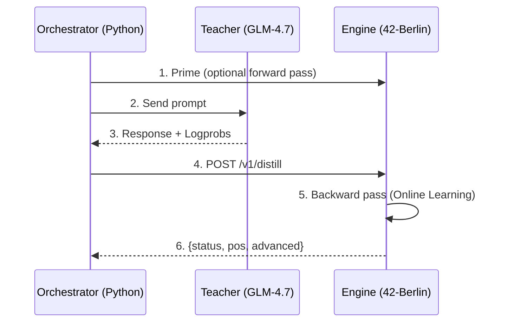

# MOPD: Multi-Teacher On-Policy Distillation

> **Status**: ✅ Implementiert (Phase 1)  
> **Codename**: "Street Fighting Distillation"

MOPD ist das Online-Learning-Framework der 42-Berlin-Engine, um Wissen von stärkeren "Teacher"-Modellen (z.B. GLM-4.7, Claude 3.5, GPT-4) in das lokale "Student"-Modell (SmolLM-135M, Ministral-3B) zu übertragen.

---

## 🏗️ Architektur



### Komponenten

| Komponente | Datei | Funktion |
|------------|-------|----------|
| **Orchestrator** | `scripts/forge_glm.py` | Python-Bridge zum Teacher |
| **API Handler** | `src/server/server.c` | HTTP Endpoint `/v1/distill` |
| **Types** | `src/core/types.h` | `t_sparse_prob`, `t_distill_request` |
| **Backward Core** | `src/nested/backward.c` | Gradient-Propagation |
| **Token Bridge** | `src/tokenizer/tokenizer.c` | String→ID Mapping |

---

## 🔌 API Endpoint

### `POST /v1/distill`

Führt einen **einzelnen Gradient-Step** auf den aktuellen Logits aus.

#### Request

```json
{
  "teacher_logprobs": [
    {"token_str": "Paris", "logprob": -0.05},
    {"token_str": "Lyon", "logprob": -2.3}
  ],
  "target_token": -1,
  "alpha": 0.5,
  "advance_with_token_str": "Paris"
}
```

| Feld | Typ | Beschreibung |
|------|-----|--------------|
| `teacher_logprobs` | Array | Sparse Teacher-Distribution (Top-K) |
| `teacher_logprobs[].token_str` | String | Token als String (empfohlen) |
| `teacher_logprobs[].token` | Int | Token-ID (deprecated, Tokenizer-Mismatch!) |
| `teacher_logprobs[].logprob` | Float | Log-Wahrscheinlichkeit |
| `target_token` | Int | Hard-Label Target (-1 = ignorieren) |
| `alpha` | Float | Teacher-Gewichtung (0.0-1.0) |
| `advance_with_token_str` | String | Token zum KV-Cache hinzufügen |

#### Response

```json
{
  "status": "ok",
  "distilled": true,
  "num_teacher_probs": 15,
  "pos": 42,
  "advanced": true
}
```

---

## 🛠️ Scripts

### `scripts/forge_glm.py` (Empfohlen)

Der primäre Treiber für GLM-4.7 Integration.

| Eigenschaft | Wert |
|-------------|------|
| **Teacher** | GLM-4.7 (Z.AI API) |
| **Methode** | Hard-Label (One-Hot) |
| **Grund** | GLM unterstützt keine Logprobs |
| **alpha** | 1.0 (reine Imitation) |

**Flow:**
1. Fragt GLM-4.7 nach Completion
2. Tokenisiert den generierten Text (naiver Splitter)
3. Sendet jeden Token als One-Hot (logprob=0.0 = prob=1.0)
4. Engine lernt, den Teacher zu imitieren

```bash
export OPENAI_API_KEY=your-zhipu-key
python3 scripts/forge_glm.py --prompt "Explain C pointers" --prime
```

---

### `scripts/forge.py` (Soft-Label)

Für Teacher mit Logprob-Support (OpenAI, Anthropic via Proxy).

| Eigenschaft | Wert |
|-------------|------|
| **Teacher** | GLM-4.7 (oder andere) |
| **Methode** | Soft-Label (KL-Divergence) |
| **Logprobs** | ✅ Ja, Top-20 |
| **alpha** | 0.5 (default, konfigurierbar) |

**Flow:**
1. Fragt Teacher mit `logprobs=true, top_logprobs=20`
2. Transformiert Logprobs zu Wahrscheinlichkeiten
3. Sendet Sparse-Distribution an Engine
4. Engine minimiert KL(Student || alpha*Teacher + (1-alpha)*Hard)

```bash
export OPENAI_API_KEY=sk-...
python3 scripts/forge.py --prompt "Hello World" --alpha 0.7
```

> **⚠️ Hinweis:** GLM-4.7 unterstützt derzeit **keine Logprobs**. Für Soft-Label 
> braucht man einen Teacher wie `gpt-4-turbo` oder einen lokalen Proxy.

---

## 🧠 Theory: Hard vs. Soft Distillation

### Hard-Label (Teacher Forcing)

Der Teacher liefert nur die "richtige" Antwort, keine Verteilung.

$$L = -\log P_{student}(y_{teacher})$$

- **Vorteil:** Funktioniert mit jedem Teacher (auch ohne API-Logprobs)
- **Nachteil:** Keine Information über "fast richtige" Alternativen

**Implementiert in:** `forge_glm.py`, `backward_step_ce()`

---

### Soft-Label (KL-Divergence)

Der Teacher liefert eine Wahrscheinlichkeitsverteilung.

$$L = \alpha \cdot KL(P_{student} \| P_{teacher}) + (1-\alpha) \cdot CE(P_{student}, y_{hard})$$

- **Vorteil:** Reichere Lernsignale ("Paris" ist wahrscheinlicher als "Lyon")
- **Nachteil:** Braucht Teacher mit Logprob-API

**Implementiert in:** `forge.py`, `backward_step_distill()`

---

## 📊 Gradient Flow

### Was wird trainiert?

| Komponente | Trainiert? | Beschreibung |
|------------|------------|--------------|
| Layers 0-21 | ❌ Frozen | `FROZEN_LAYERS=22` in config |
| Layers 22-29 | ✅ Trainiert | W2 weights (down-projection) |
| Final Adapter | ✅ Trainiert | `dim×dim` Matrix vor Output |
| Context Bias | ✅ Trainiert | Bigram-basierte Token-Boosts |
| Output Layer | ❌ Frozen | Tied to embeddings |

> **Wichtig:** Dies ist KEIN "Last-Layer-Only" Training!  
> Wir machen echte Backprop durch alle unfrozen Layers.

### Backprop Pipeline

```
POST /v1/distill
       │
       ▼
┌─────────────────────────────────────────┐
│  handle_distill() (server.c)            │
│  - Parse JSON                           │
│  - token_str → token_id (Tokenizer)     │
│  - Convert logprob → prob (exp())       │
└─────────────────────────────────────────┘
       │
       ▼
┌─────────────────────────────────────────┐
│  backward_step_distill() (backward.c)   │
│  - Q = softmax(student_logits)          │
│  - P = alpha*teacher + (1-alpha)*hard   │
│  - dL/dlogits = Q - P  [Gradient!]      │
└─────────────────────────────────────────┘
       │
       ▼
┌─────────────────────────────────────────┐
│  backward_propagate_logits()            │
│  - backprop_output_layer() → grad_x     │
│  - For layer in [n_layers-1 ... 0]:     │
│      if layer >= FROZEN_LAYERS:         │
│          accumulate_layer_grads()       │
└─────────────────────────────────────────┘
       │
       ▼
┌─────────────────────────────────────────┐
│  backward_apply_grads() [after turn]    │
│  - FP32 → BF16 with Stochastic Rounding │
│  - Per-layer Gradient Norm Clipping     │
│  - bf16_stochastic_update() per weight  │
└─────────────────────────────────────────┘
```

### Gradient Accumulation

Gradients werden **in FP32 akkumuliert** (`grad_acc` buffer), um BF16 Mantissa-Unterläufe zu vermeiden. Am Ende des Turns werden sie mit Stochastic Rounding in die BF16-Weights geschrieben.

---

## 🔧 Configuration

### Hyperparameter (src/config.h)

| Parameter | Default | Beschreibung |
|-----------|---------|--------------|
| `NESTED_LR` | 0.01 | Base Learning Rate |
| `LEARNING_THRESHOLD` | 0.1 | Skip if loss < this |
| `HIGH_LOSS_THRESHOLD` | 10.0 | Skip if loss > this (noise) |
| `GRADIENT_CLIP` | 1.0 | Per-element gradient clipping |
| `FROZEN_LAYERS` | 22 | Layers 0-21 frozen, rest trainable |
| `ADAPTER_SCALE` | 0.1 | Final adapter gradient scaling |

### Alpha Parameter

| alpha | Bedeutung |
|-------|-----------|
| 0.0 | Pure Hard-Label (ignore teacher probs) |
| 0.5 | 50/50 Teacher + Hard-Label |
| 1.0 | Pure Teacher Imitation |

---

## 📈 Performance

| Operation | Latency | Notes |
|-----------|---------|-------|
| Token Lookup | ~1µs | Hash-based vocab lookup |
| Distill Backward | ~5ms | Per token, 8 threads |
| Gradient Apply | ~10ms | After turn ends |

---

## 🚧 Known Limitations

1. **Single Teacher Only** - "Multi-Teacher" in name, but only one at a time  
2. **No Streaming** - Batch mode only  
3. **GLM-4.7 = Hard-Labels** - No logprob API support  
4. **Tokenizer Mismatch** - String-based mapping is heuristic  

---

## 🔮 Roadmap

- [ ] Multi-Teacher Ensemble (weighted average of distributions)
- [ ] Streaming Distillation (token-by-token while Teacher generates)
- [ ] Anthropic Claude Support (via `/v1/messages` proxy)
- [ ] Local Teacher Mode (use larger local model as teacher)

---

## 📚 References

- [Hinton et al., "Distilling the Knowledge in a Neural Network" (2015)](https://arxiv.org/abs/1503.02531)
- [Z.AI GLM-4.7 Documentation](https://docs.z.ai)
- [42-Berlin-Engine Project Status](PROJECT_STATUS.md)
